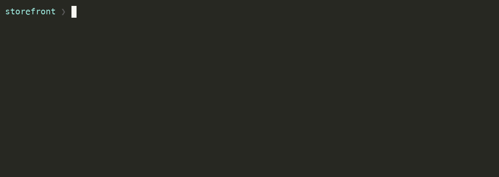
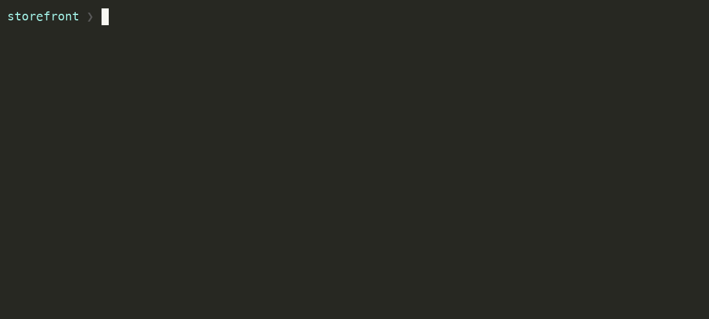
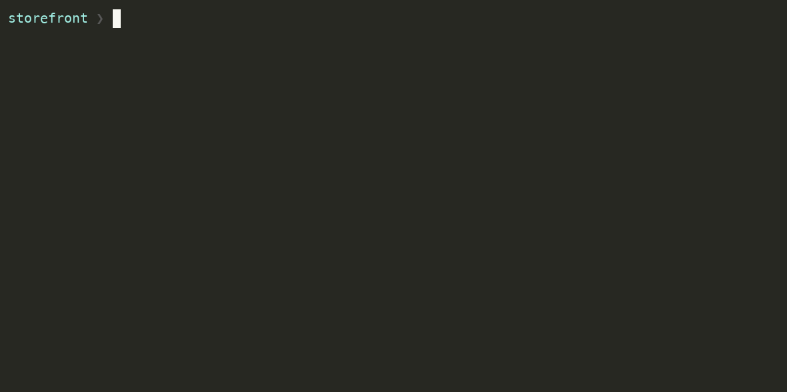
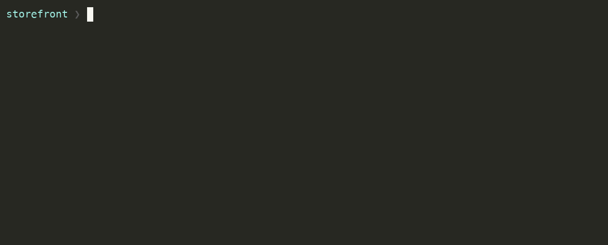
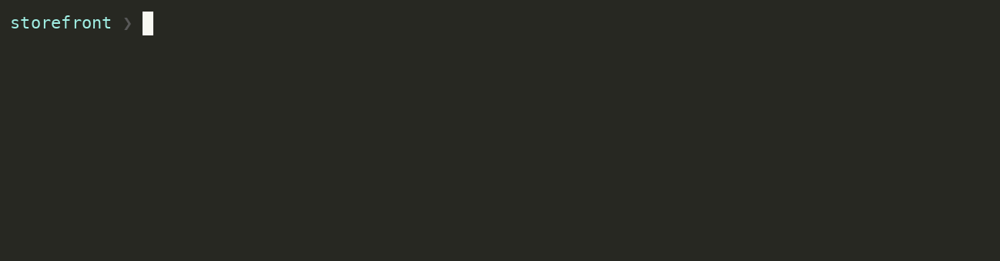

# termwise

A terminal assistant for command generation and quick answers. Describe what you
want; get the command, or the answer, without leaving the shell.

It checks before it answers — what's installed, how it got there, what's in the
repo — and then **proposes** the command rather than running it.



Full coding agents are powerful but heavy. Spinning one up to remember a `find`
flag or ask one question about the repo you're standing in is overkill. termwise
is built for the gap between "google it" and "start an agent session."

---

## Install

Needs Go 1.26+.

```bash
go install github.com/matteo-psnt/termwise/cmd/termwise@latest
```

That gives you `termwise`. The shell integration below adds `tw`, which is what
you'll actually type.

## Shell setup

The shell integration defines the `tw` function and binds the inline widget.
Add the line for your shell:

```bash
eval "$(termwise init zsh)"     # ~/.zshrc
eval "$(termwise init bash)"    # ~/.bashrc
termwise init fish | source     # ~/.config/fish/config.fish
```

Then pick a provider:

```bash
tw config
```

First run walks you through provider, model and where the API key comes from —
an environment variable, a command, or the system keychain. Anthropic, OpenAI,
Groq, DeepSeek and Mistral are built in, plus **Ollama** if you'd rather nothing
left the machine.

---

## What it does

### Ctrl+T — from your shell prompt

Type the intent where the command would have gone, press **Ctrl+T**, and the
finished command comes back in your buffer, ready to edit or run.


### It proposes; you decide

Ask for something destructive and nothing is destroyed. The agent looks, works
out the command, and hands it to you. `e` opens it for editing first.



`bash` is restricted to read-only commands and temp-directory scratch, so
anything that would change your machine can only ever be *proposed*. There is no
path where termwise edits your files.

### `tw explain` — the other direction

Every other entry point turns intent into a command. This one goes back: give it
a command and it breaks down the binary, each flag, and how the pieces chain —
checking `man` and `--help` rather than guessing, and leading with the damage
when there is any.



```bash
tw explain 'awk -F: "{print $1}" /etc/passwd'
tw explain              # asks which command to explain
fc -ln -1 | tw explain  # explains the one you just ran
```

It's given no command tool at all, so it can only explain — it will never hand
you something new to run.

### `@` — point at a file

Type `@` and Tab through the project. Directories complete with a trailing `/`
and reopen on their contents, so descending a tree is one keystroke per level;
dotfiles stay out of the way unless you type the leading dot yourself.



The `@` survives into the prompt — the agent is told an `@`-prefixed path is
something you're pointing at, so it reads the file before answering. That works
in `tw ask` and `tw explain` too, where there's no dropdown to help you type it.

### `tw ask` — headless

One shot, straight to stdout, no TUI. Good for piping and quick lookups.



Anything piped in becomes context for the question:


### Settings apply as you move

`/theme` repaints the whole interface under you, so you pick by looking rather
than by guessing. `/model`, `/effort` and `/config` work the same way.


---

## Principles

- **Verified, not guessed** — it checks what's installed and where a binary came
  from before proposing anything. This is what stops `npm uninstall` for a
  Homebrew-installed binary, or an `rg` command on a machine without ripgrep.
- **Read-only by default** — it never edits your files; `bash` is limited to
  read-only commands and temp-directory scratch, and anything else needs your
  approval.
- **Terminal-native** — TUI commands can be pushed into your shell buffer;
  headless runs print to stdout and pipe like anything else.
- **Minimal** — open the TUI when you want the context, use `tw ask` when you
  just want the answer.
- **Local** — one binary, your own API keys, no account, and logs that never
  leave `~/.config/termwise/`.

## What it knows about your machine

The agent is given your OS, shell, working directory, detected project type, git
branch and state, and — importantly — which package managers and CLI tools you
actually have installed.

Recent shell history is **off by default**, because history can contain secrets
typed inline. Turn it on with `tw config` → Shell context.

## Entry points

```bash
tw                                # open the TUI
tw "undo my last commit but keep the changes"
tw ask "how do I run the dev server here"
tw explain 'git reset --hard HEAD~1'
tw --resume                       # pick the last session back up
git diff | tw ask "summarise this"
```

Every one of them runs the same agent loop, reading files, searching code and
running read-only commands to check facts before it answers.

## Logs

Local only, under `~/.config/termwise/`:

| File | Contents |
|---|---|
| `config.toml` | Provider, model, and settings |
| `prompt-history.jsonl` | Prompts you've typed, for up-arrow recall |
| `exchanges.jsonl` | Completed turns — prompt, response, tools used, model |
| `sessions/` | Full conversations, for `--resume` |

## Building from source

```bash
go install ./cmd/termwise/...
```

The demo GIFs above are reproducible — see [`assets/README.md`](assets/README.md).
